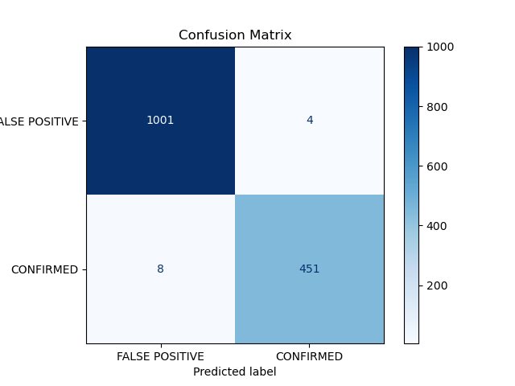
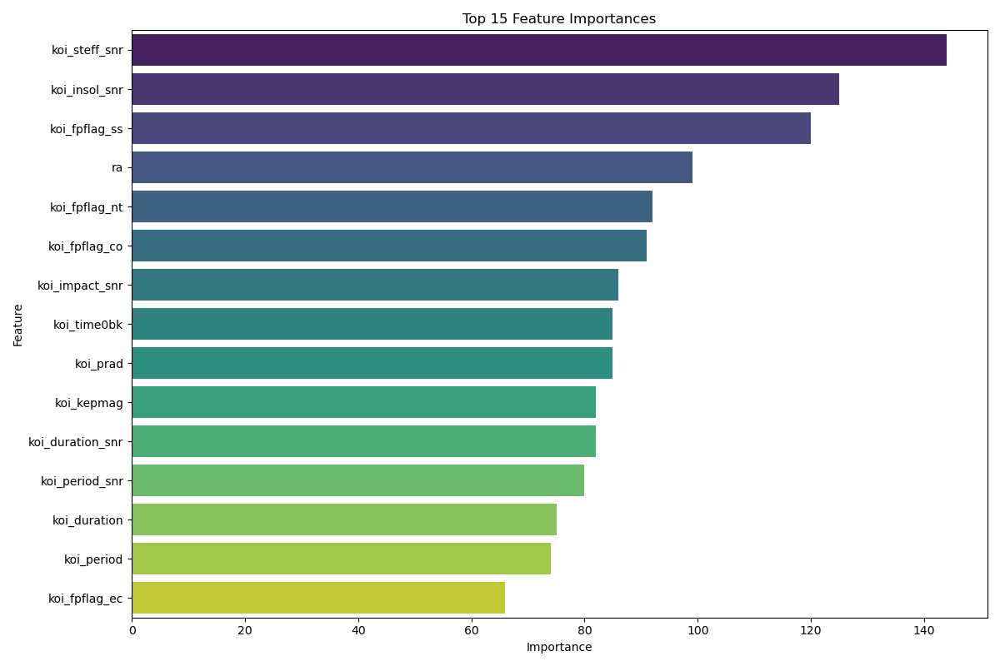

# Exo-Hunter: Exoplanet Classification Project

## 1. Project Objective

The goal of the Exo-Hunter project is to develop a high-accuracy classification model to distinguish between confirmed exoplanets and astrophysical false positives using photometric data from NASA's Kepler Space Telescope. The project leverages a robust machine learning pipeline to preprocess data, engineer insightful features, and train a highly performant model. The final, trained model is then used to score and rank unclassified "Candidate" objects, providing a prioritized list for further scientific investigation.

## 2. Dataset

*   **Source**: Kepler Objects of Interest (KOI) Data from the NASA Exoplanet Archive.
*   **Local Copy**: The dataset is included in this repository at `data/cumulative.csv`.

## 3. Project Structure

The project is organized into a modular structure for clarity, maintainability, and reproducibility:

```
├── data/
│   └── cumulative.csv
├── output/                 # Generated files (model, ranked candidates)
│   ├── ranked_candidates.csv
│   └── exo_hunter_model.joblib
├── plots/                  # Generated plots
│   ├── confusion_matrix.png
│   └── feature_importance.png
├── src/
│   ├── __init__.py
│   ├── config.py
│   ├── data_loader.py
│   ├── preprocessing.py
│   ├── model_evaluation.py
│   └── evaluation.py
├── main.py                 # Main script for TRAINING
├── rank_candidates.py      # Script for PREDICTION
├── requirements.txt
└── README.md
```

## 4. Methodology

1.  **Data Preprocessing**: The raw data is cleaned by dropping irrelevant columns. Missing values are robustly handled using median imputation.
2.  **Feature Engineering**: A key step was the creation of **Signal-to-Noise Ratio (SNR)** features for all physical measurements with corresponding errors. This proved to be highly predictive.
3.  **Model Selection**: Three baseline models were evaluated using 5-fold cross-validation:
    *   `RandomForestClassifier`
    *   `MLPClassifier` (Neural Network)
    *   `LGBMClassifier`
    
    The `LGBMClassifier` was selected as the top-performing architecture due to its superior F1-score and accuracy.
4.  **Hyperparameter Tuning**: `RandomizedSearchCV` was used to find the optimal hyperparameters for the `LGBMClassifier`.
5.  **Separated Workflows**: The project is split into two distinct pipelines: a training pipeline (`main.py`) and a prediction pipeline (`rank_candidates.py`).

## 5. Final Model Performance

The final, tuned model was evaluated on a held-out test set. The results demonstrate an exceptionally high level of performance with an **overall accuracy and F1-score of 99%**.

### Confusion Matrix



The matrix shows extremely low error rates, with only 4 false positives and 8 false negatives out of 1,464 test samples.

### Feature Importance



The engineered **SNR features** and the astronomers' **false positive flags** were the most influential predictors, validating our data-centric approach.

## 6. Prioritized Candidates

The final model was used to predict the confirmation probability for 2,248 unclassified "Candidate" objects. The top 10 most promising candidates are listed below:

| kepoi_name | confirmation_probability |
|------------|--------------------------|
| K00315.01  | 1.0                      |
| K01475.02  | 1.0                      |
| K01871.02  | 1.0                      |
| K00865.01  | 1.0                      |
| K00415.01  | 1.0                      |
| K00211.01  | 1.0                      |
| K01466.01  | 1.0                      |
| K00339.03  | 1.0                      |
| K01239.02  | 1.0                      |
| K03319.01  | 1.0                      |

## 7. How to Use

### Setup

1.  Clone this repository.
2.  Install the required Python libraries:
    ```bash
    pip install -r requirements.txt
    ```

### Option A: Run the Full Training Pipeline

This will run the entire workflow from scratch and save the model and plots.

```bash
python main.py
```

### Option B: Rank Candidates with the Pre-trained Model

If a model has already been trained, you can use it to rank the candidates.

```bash
python rank_candidates.py
```
This will generate a `ranked_candidates.csv` file in the `output/` directory.
